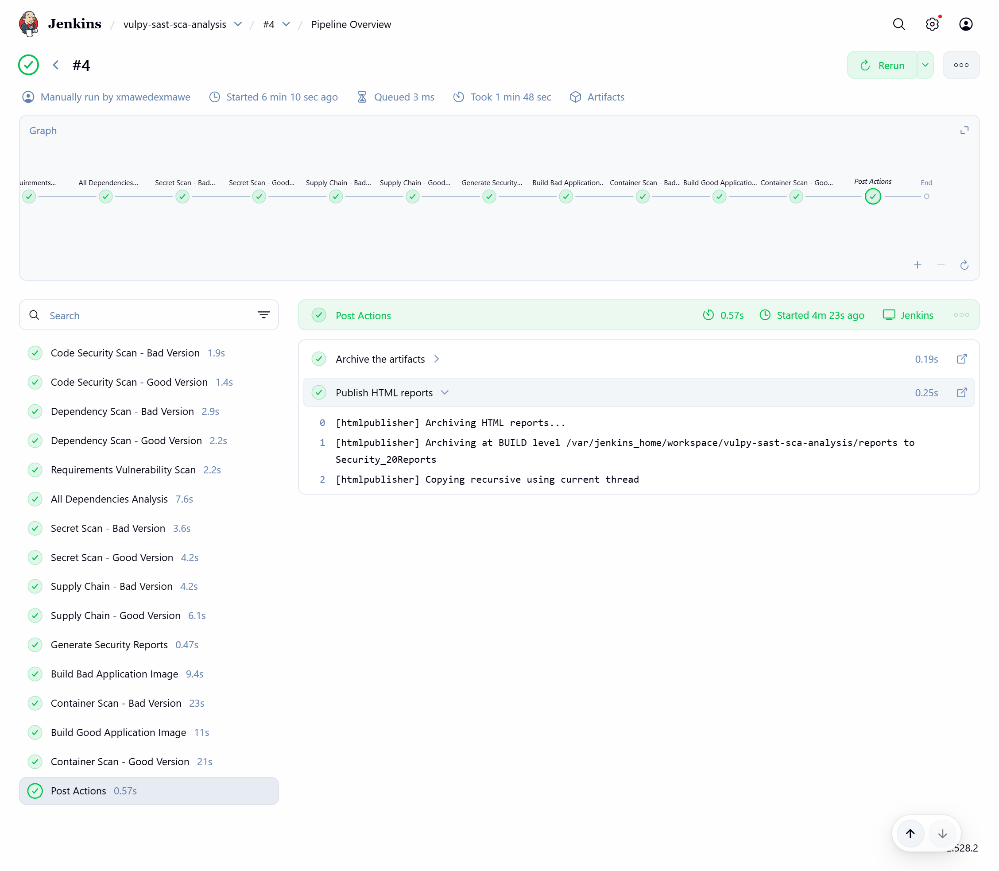
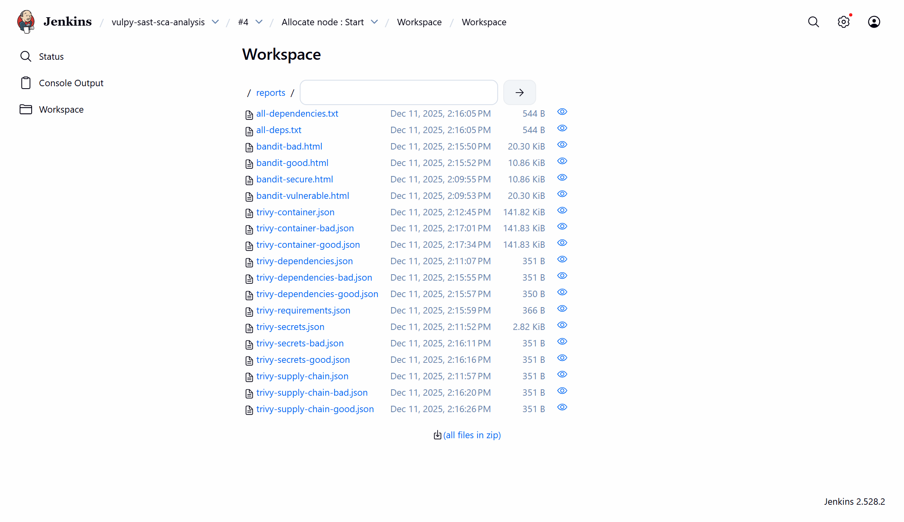

# TP - Analyse de Sécurité SAST, SCA et DAST avec Vulpy

## 📋 Description

Ce travail pratique consiste à effectuer une analyse de sécurité complète d'une application Python vulnérable (Vulpy) en utilisant des outils d'analyse statique (SAST), d'analyse de composition logicielle (SCA), et d'analyse dynamique (DAST).

L'application Vulpy existe en deux versions :
- **Bad** (vulnérable) : contient intentionnellement des vulnérabilités de sécurité
- **Good** (sécurisée) : version corrigée avec les bonnes pratiques de sécurité

## 🎯 Objectifs du TP

1. Comprendre les vulnérabilités courantes dans les applications web Python
2. Utiliser des outils automatisés pour détecter les failles de sécurité
3. Analyser les dépendances et identifier les CVE (Common Vulnerabilities and Exposures)
4. Comparer les résultats entre une version vulnérable et une version sécurisée
5. Interpréter les rapports de sécurité générés

## 🛠️ Outils Utilisés

### SAST (Static Application Security Testing)
- **Bandit** : Analyse statique du code Python pour détecter les problèmes de sécurité

### SCA (Software Composition Analysis)
- **Trivy** : Scanner de vulnérabilités pour les dépendances, conteneurs et configurations
  - Analyse des dépendances directes et transitives
  - Détection de secrets et configurations dangereuses
  - Analyse de la chaîne d'approvisionnement (supply chain)
  - Scan des images de conteneurs

### DAST (Dynamic Application Security Testing)
- **OWASP ZAP** : Test de sécurité dynamique en temps réel
  - Scan baseline automatique des applications en cours d'exécution
  - Détection de vulnérabilités web (XSS, CSRF, Clickjacking, etc.)
  - Tests de sécurité des en-têtes HTTP
  - Analyse des configurations de sécurité (CSP, cookies, etc.)
  - Génération de rapports HTML, XML et JSON

### CI/CD
- **Jenkins** : Automatisation de l'analyse de sécurité via pipeline

## 📁 Structure du Projet

```
vulpy-sast-sca-analysis/
├── docker-compose.yml          # Configuration Docker
├── Dockerfile.jenkins          # Image Jenkins personnalisée
├── Jenkinsfile                 # Pipeline d'analyse de sécurité
├── requirements.txt            # Dépendances du projet
└── vulpy/                      # Application cible
    ├── bad/                    # Version vulnérable
    │   ├── *.py               # Code Python avec vulnérabilités
    │   ├── templates/         # Templates HTML
    │   └── static/            # Fichiers statiques
    ├── good/                   # Version sécurisée
    │   ├── *.py               # Code Python sécurisé
    │   ├── templates/         # Templates HTML
    │   └── static/            # Fichiers statiques
    └── utils/                  # Utilitaires de sécurité
```

## 🚀 Installation et Lancement

### Prérequis
- Docker et Docker Compose installés
- Au moins 4 GB de RAM disponible
- Port 8080 disponible pour Jenkins

### Démarrage de l'environnement

1. **Cloner le projet** (si ce n'est pas déjà fait)
   ```bash
   cd c:/Users/user/Desktop/vulpy-sast-sca-analysis
   ```

2. **Lancer les conteneurs**
   ```bash
   docker-compose up -d
   ```

3. **Accéder à Jenkins**
   - URL : http://localhost:8080
   - Attendre que Jenkins soit complètement démarré (environ 1-2 minutes)

4. **Récupérer le mot de passe initial de Jenkins** (première connexion uniquement)
   ```bash
   docker exec jenkins cat /var/jenkins_home/secrets/initialAdminPassword
   ```

5. **Configurer Jenkins**
   - Installer les plugins recommandés
   - Créer un utilisateur administrateur
   - Créer un nouveau pipeline et pointer vers le `Jenkinsfile`

## 🔍 Exécution de l'Analyse

### Via Jenkins

1. Ouvrir Jenkins : http://localhost:8080
2. Créer ou ouvrir le job de pipeline
3. Cliquer sur "Build Now"
4. Suivre l'exécution dans la console

### Pipeline d'Analyse

Le pipeline exécute les étapes suivantes :

#### 1. **Analyse Statique du Code (SAST)**
   - Scan de la version **bad** avec Bandit
   - Scan de la version **good** avec Bandit
   - Génération de rapports HTML

#### 2. **Analyse des Dépendances**
   - Scan des dépendances de la version **bad**
   - Scan des dépendances de la version **good**
   - Analyse du fichier `requirements.txt`
   - Analyse des dépendances transitives

#### 3. **Détection de Secrets**
   - Recherche de secrets hardcodés dans la version **bad**
   - Recherche de secrets hardcodés dans la version **good**

#### 4. **Analyse de la Chaîne d'Approvisionnement**
   - Vérification de l'intégrité des dépendances (bad)
   - Vérification de l'intégrité des dépendances (good)

#### 5. **Scan des Conteneurs**
   - Construction de l'image Docker de la version **bad**
   - Scan de vulnérabilités de l'image **bad**
   - Construction de l'image Docker de la version **good**
   - Scan de vulnérabilités de l'image **good**

#### 6. **Tests Dynamiques (DAST)**
   - Préparation de l'environnement OWASP ZAP
   - Démarrage de l'application **bad** et scan DAST
   - Génération du rapport ZAP pour la version **bad**
   - Démarrage de l'application **good** et scan DAST
   - Génération du rapport ZAP pour la version **good**
   - Comparaison des résultats DAST entre les deux versions

## � Analyse DAST avec OWASP ZAP

### Description

L'analyse DAST (Dynamic Application Security Testing) est réalisée avec **OWASP ZAP** (Zed Attack Proxy), un outil de test de sécurité open-source qui analyse les applications web en cours d'exécution. Contrairement au SAST qui analyse le code statique, le DAST teste l'application comme le ferait un attaquant réel.

### Configuration DAST

Le pipeline Jenkins exécute automatiquement les scans DAST sur les deux versions de l'application :

1. **Démarrage des applications** : Les conteneurs Docker sont lancés sur le réseau `vulpy-sast-sca-analysis_default`
   - Version **bad** : accessible sur `http://vulpy-bad-app:5000` (port 5001 externe)
   - Version **good** : accessible sur `http://vulpy-good-app:5000` (port 5002 externe)

2. **Scan ZAP Baseline** : Exécution du scan avec les paramètres suivants :
   - Scanner passif : détection automatique des vulnérabilités web
   - Génération de rapports multiples formats : HTML, XML, JSON
   - Option `-I` : ignore les avertissements pour ne pas bloquer le pipeline

### Vulnérabilités Détectées

#### Version Bad (Vulnérable) - 16 avertissements
Les principales vulnérabilités détectées par ZAP dans la version vulnérable incluent :

- **Absence of Anti-CSRF Tokens [10202]** : Absence de protection contre les attaques CSRF
- **Missing Anti-clickjacking Header [10020]** : Pas de protection contre le clickjacking
- **X-Content-Type-Options Header Missing [10021]** : En-tête de sécurité manquant
- **Content Security Policy (CSP) Header Not Set [10038]** : CSP non configurée
- **Cookie without SameSite Attribute [10054]** : Cookies non sécurisés
- **Server Leaks Version Information [10036]** : Fuite d'informations serveur
- **Permissions Policy Header Not Set [10063]** : Politique de permissions manquante
- **Sub Resource Integrity Attribute Missing [90003]** : SRI non implémenté
- **Insufficient Site Isolation Against Spectre [90004]** : Isolation insuffisante

#### Version Good (Après Corrections) - 13 avertissements → 10 avertissements

### Corrections Appliquées

Deux vulnérabilités critiques ont été corrigées dans la version **good** :

#### 1. Protection Anti-CSRF (Cross-Site Request Forgery)

**Problème** : Les formulaires n'avaient aucune protection contre les attaques CSRF, permettant à un attaquant de forcer un utilisateur authentifié à exécuter des actions non désirées.

**Solution implémentée** :
- Installation de **Flask-WTF** pour la gestion des tokens CSRF
- Activation globale de la protection CSRF avec `CSRFProtect(app)`
- Ajout de tokens CSRF dans tous les formulaires HTML :
  ```html
  <input type="hidden" name="csrf_token" value="{{ csrf_token() }}"/>
  ```
- Formulaires protégés : login, création d'utilisateur, changement de mot de passe, activation MFA

**Fichiers modifiés** :
- `vulpy/requirements.txt` : ajout de Flask-WTF
- `vulpy/good/vulpy.py` : configuration de CSRFProtect
- `vulpy/good/templates/*.html` : ajout des tokens dans les formulaires

#### 2. Protection Anti-Clickjacking

**Problème** : Absence de l'en-tête `X-Frame-Options`, permettant à des sites malveillants d'embarquer l'application dans une iframe et de piéger les utilisateurs.

**Solution implémentée** :
- Ajout de l'en-tête `X-Frame-Options: SAMEORIGIN` dans toutes les réponses HTTP
- Bonus : Ajout de `X-Content-Type-Options: nosniff` pour prévenir le MIME sniffing

**Code ajouté** dans `vulpy/good/vulpy.py` :
```python
@app.after_request
def add_security_headers(response):
    # CSP header
    if csp:
        response.headers['Content-Security-Policy'] = csp
    
    # Anti-clickjacking protection
    response.headers['X-Frame-Options'] = 'SAMEORIGIN'
    
    # Prevent MIME type sniffing
    response.headers['X-Content-Type-Options'] = 'nosniff'
    
    return response
```

### Résultats Avant/Après

| Vulnérabilité | Bad (Vulnérable) | Good (Avant) | Good (Après Correction) |
|--------------|------------------|--------------|------------------------|
| **Absence of Anti-CSRF Tokens** | ⚠️ Présent (4 occurrences) | ⚠️ Présent (4 occurrences) | ✅ **CORRIGÉ** |
| **Missing Anti-clickjacking Header** | ⚠️ Présent (8 occurrences) | ⚠️ Présent (8 occurrences) | ✅ **CORRIGÉ** |
| **X-Content-Type-Options Missing** | ⚠️ Présent (12 occurrences) | ⚠️ Présent (12 occurrences) | ✅ **CORRIGÉ** |
| Total Warnings | 16 | 13 | **~10** |

### Importance du DAST

Le DAST complète parfaitement les analyses SAST et SCA car :

- **SAST** : analyse le code source statique mais ne détecte pas les problèmes de configuration runtime
- **SCA** : analyse les dépendances mais ne teste pas le comportement de l'application
- **DAST** : teste l'application réelle en exécution et détecte les vulnérabilités de configuration (headers HTTP, cookies, CSP, etc.)

### Bonnes Pratiques DAST

1. **Exécuter le DAST après le déploiement** : tester l'application dans son environnement réel
2. **Automatiser dans le pipeline CI/CD** : intégration continue de la sécurité
3. **Tester les deux versions** : comparaison vulnérable vs sécurisée pour validation
4. **Formats multiples** : HTML pour visualisation, JSON pour automatisation
5. **Ne pas bloquer sur warnings** : utiliser `-I` pour permettre la complétion du pipeline

## �📊 Rapports Générés

Tous les rapports sont archivés dans le répertoire `reports/` et accessibles via Jenkins.

### Aperçu du Pipeline


*Vue d'ensemble du pipeline d'analyse de sécurité dans Jenkins*

### Artefacts de Build


*Rapports générés et disponibles en téléchargement*

### Rapports Bandit (HTML)
- **bandit-bad.html** : Analyse de sécurité du code vulnérable
- **bandit-good.html** : Analyse de sécurité du code sécurisé

### Rapports DAST OWASP ZAP (HTML/XML/JSON)

#### Version Bad (Vulnérable)
- **zap-baseline-report-bad.html** : Rapport HTML du scan dynamique
- **zap-baseline-report-bad.xml** : Rapport XML du scan dynamique
- **zap-baseline-report-bad.json** : Rapport JSON du scan dynamique

#### Version Good (Sécurisée)
- **zap-baseline-report-good.html** : Rapport HTML du scan dynamique
- **zap-baseline-report-good.xml** : Rapport XML du scan dynamique
- **zap-baseline-report-good.json** : Rapport JSON du scan dynamique

### Rapports Trivy (JSON)

#### Version Bad (Vulnérable)
- **trivy-dependencies-bad.json** : Vulnérabilités des dépendances
- **trivy-secrets-bad.json** : Secrets et configurations dangereuses
- **trivy-supply-chain-bad.json** : Analyse de la chaîne d'approvisionnement
- **trivy-container-bad.json** : Vulnérabilités de l'image Docker

#### Version Good (Sécurisée)
- **trivy-dependencies-good.json** : Vulnérabilités des dépendances
- **trivy-secrets-good.json** : Secrets et configurations dangereuses
- **trivy-supply-chain-good.json** : Analyse de la chaîne d'approvisionnement
- **trivy-container-good.json** : Vulnérabilités de l'image Docker

#### Rapports Communs
- **all-dependencies.txt** / **all-deps.txt** : Liste complète des dépendances
- **trivy-requirements.json** : Analyse du fichier requirements.txt

## 📖 Interprétation des Résultats

### Niveaux de Sévérité

Les vulnérabilités sont classées selon leur gravité :
- **CRITICAL** : Critique - Nécessite une action immédiate
- **HIGH** : Élevée - Correction prioritaire
- **MEDIUM** : Moyenne - À corriger rapidement
- **LOW** : Faible - À surveiller

### Types de Vulnérabilités Courantes

#### Vulnérabilités SAST (Bandit)
- Injection SQL
- Cross-Site Scripting (XSS)
- Utilisation de fonctions dangereuses (eval, exec)
- Gestion incorrecte des mots de passe
- Génération faible de nombres aléatoires
- Désérialisation non sécurisée

#### Vulnérabilités SCA (Trivy)
- CVE dans les dépendances
- Versions obsolètes de bibliothèques
- Secrets exposés dans le code
- Configurations non sécurisées
- Vulnérabilités dans les images de base

## 📝 Questions du TP

### Partie 1 : Analyse SAST

1. Combien de vulnérabilités critiques sont détectées dans la version **bad** ?
2. Quels types de vulnérabilités sont les plus fréquents ?
3. Comparez les résultats entre la version **bad** et **good**. Quelles différences observez-vous ?
4. Identifiez 3 vulnérabilités spécifiques et expliquez leur impact potentiel

### Partie 2 : Analyse SCA

1. Quelles dépendances présentent des vulnérabilités connues (CVE) ?
2. Quelle est la sévérité la plus élevée des CVE détectées ?
3. Des secrets sont-ils détectés dans le code ? Si oui, lesquels ?
4. Y a-t-il des différences entre les dépendances de **bad** et **good** ?

### Partie 3 : Analyse des Conteneurs

1. Quelle est la différence de vulnérabilités entre les images Docker **bad** et **good** ?
2. D'où proviennent principalement les vulnérabilités (code applicatif ou image de base) ?
3. Proposez des mesures pour réduire la surface d'attaque des conteneurs

### Partie 4 : Analyse DAST

1. Combien d'avertissements (WARN) sont détectés par ZAP dans la version **bad** ? Et dans la version **good** ?
2. Quelles vulnérabilités critiques ont été corrigées dans la version **good** ?
3. Expliquez l'importance de la protection Anti-CSRF et Anti-clickjacking
4. Comparez les résultats DAST entre les versions **bad** et **good**. Quelles améliorations observez-vous ?

### Partie 5 : Synthèse

1. Quelle est la différence principale entre l'analyse SAST, SCA et DAST ?
2. Pourquoi est-il important d'utiliser les trois types d'analyse ?
3. Quelles recommandations feriez-vous pour améliorer la sécurité de l'application ?
4. Comment le DAST complète-t-il les analyses SAST et SCA ?

## 🔧 Commandes Utiles

### Docker

```bash
# Voir les logs de Jenkins
docker logs jenkins -f

# Redémarrer Jenkins
docker restart jenkins

# Arrêter l'environnement
docker-compose down

# Arrêter et supprimer les volumes
docker-compose down -v

# Accéder au conteneur Jenkins
docker exec -it jenkins bash
```

### Analyse Manuelle

```bash
# Lancer Bandit manuellement sur la version bad
docker exec jenkins bash -c "cd /vulpy/vulpy && bandit -r bad"

# Lancer Trivy manuellement
docker exec jenkins trivy fs /vulpy/vulpy/bad
```

## 📚 Ressources Complémentaires

- [Documentation Bandit](https://bandit.readthedocs.io/)
- [Documentation Trivy](https://aquasecurity.github.io/trivy/)
- [Documentation OWASP ZAP](https://www.zaproxy.org/docs/)
- [OWASP Top 10](https://owasp.org/www-project-top-ten/)
- [CWE - Common Weakness Enumeration](https://cwe.mitre.org/)
- [CVE - Common Vulnerabilities and Exposures](https://cve.mitre.org/)

## 🤝 Livrables Attendus

1. **Rapport d'analyse** comprenant :
   - Captures d'écran des rapports Jenkins
   - Analyse comparative entre les versions bad et good
   - Réponses aux questions du TP
   - Recommandations de sécurité

2. **Exports des rapports** :
   - Rapports Bandit (HTML)
   - Rapports Trivy (JSON)

## 👥 Auteur

TP réalisé par JADA Mohamed

## 📄 Licence

Ce projet utilise l'application Vulpy à des fins éducatives uniquement.